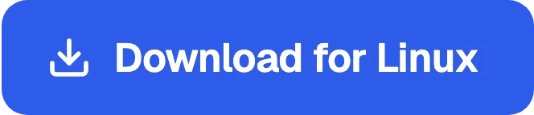
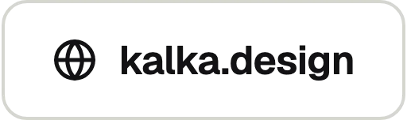
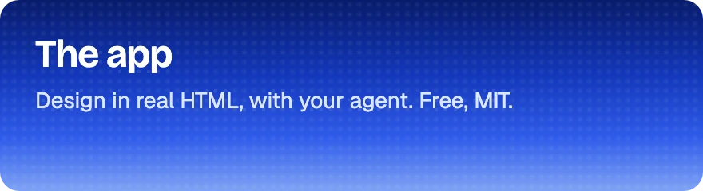
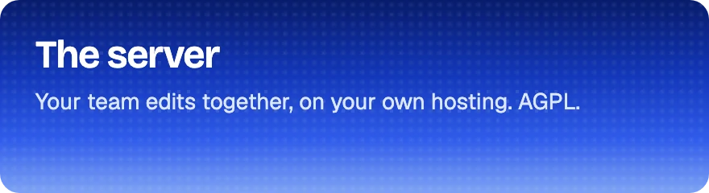
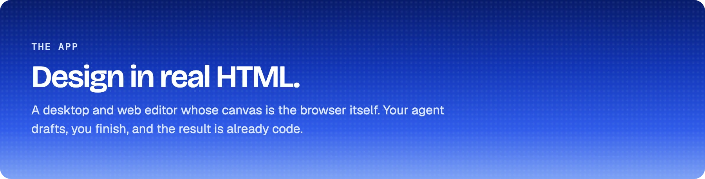
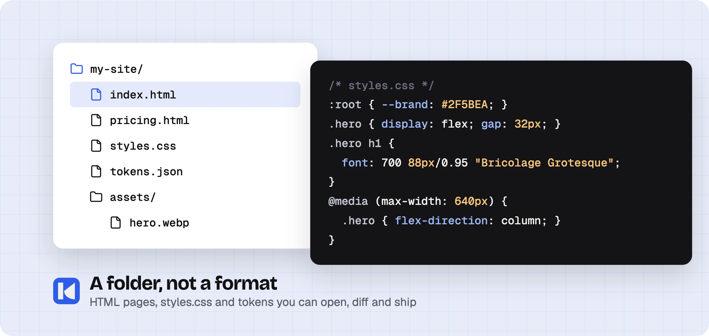
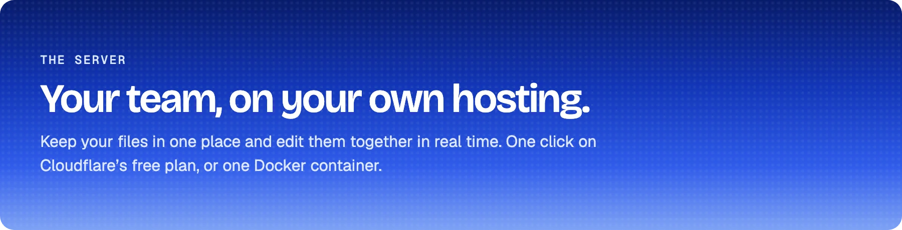
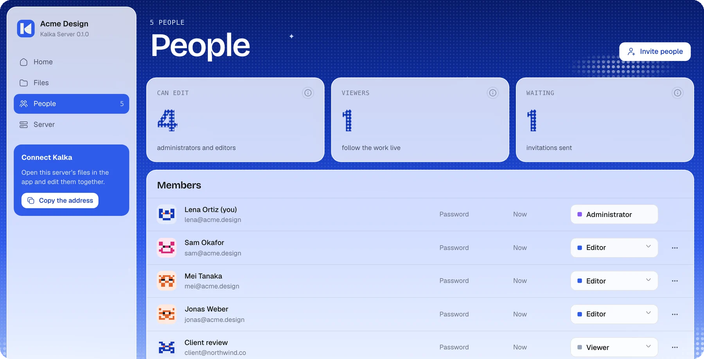
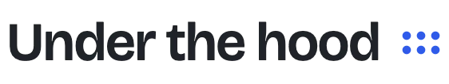
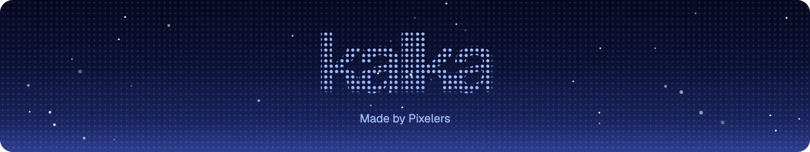

<p align="center">
  <a href="https://kalka.design">
    <picture>
      <source media="(prefers-color-scheme: dark)" srcset="assets/readme/hero-dark.webp">
      
    </picture>
  </a>
</p>

<p align="center">
  <strong>An open source design tool, an alternative to Figma, where every layer is real HTML and CSS.</strong><br />
  AI thinks in code, not pixels: your agent drafts in the HTML and CSS it already knows, you refine by hand, and nothing gets redrawn in code.
</p>

<p align="center">
  <a href="https://kalka.design/api/download/mac-arm64"></a>
  <a href="https://kalka.design/api/download/windows"></a>
  <a href="https://kalka.design/api/download/linux"></a>
  <a href="https://kalka.design">
    <picture>
      <source media="(prefers-color-scheme: dark)" srcset="assets/readme/button-site-dark.webp">
      
    </picture>
  </a>
</p>

<p align="center">
  <sub>macOS (Apple silicon or <a href="https://kalka.design/api/download/mac-x64">Intel</a>), Windows and Linux. Free and open source. Beta: builds are not signed yet, see <a href="#install">Install</a>.</sub>
</p>

<p align="center">
  <a href="https://github.com/leyscore/kalka/releases"></a>
  <a href="https://github.com/leyscore/kalka/stargazers"></a>
  <a href="LICENSE"></a>
  <a href="server/LICENSE"></a>
  <a href="https://kalka.design/docs"></a>
  <a href="https://x.com/bedleybuilds"></a>
  
</p>

<p align="center"></p>

<table>
  <tr>
    <td width="50%" valign="top">
      <a href="#the-app"><picture>
    <source media="(prefers-color-scheme: dark)" srcset="assets/readme/card-app-dark.webp">
    
  </picture></a>
      <br /><a href="https://kalka.design/api/download/mac-arm64">Download</a> &nbsp; <a href="#the-app">How it works</a>
    </td>
    <td width="50%" valign="top">
      <a href="#the-server"><picture>
    <source media="(prefers-color-scheme: dark)" srcset="assets/readme/card-server-dark.webp">
    
  </picture></a>
      <br /><a href="https://deploy.workers.cloudflare.com/?url=https://github.com/leyscore/kalka/tree/main/server">Deploy in one click</a> &nbsp; <a href="./server/README.md">Server guide</a>
    </td>
  </tr>
</table>

<br />

<h2 id="the-app" align="center">
  <picture>
    <source media="(prefers-color-scheme: dark)" srcset="assets/readme/part-app-dark.webp">
    
  </picture>
</h2>


<br />

<p align="center">
  <picture>
    <source media="(prefers-color-scheme: dark)" srcset="assets/readme/heading-canvas-dark.webp">
    
  </picture>
</p>

<p align="center">Every layer is an element the browser lays out and paints,<br />so flexbox, grid, fonts, shadows and blurs look on the canvas exactly as they will in production.</p>

<table>
  <tr>
    <td width="50%"><strong>The layers panel is the DOM.</strong><br />A layer can be an <code>h1</code>, <code>nav</code>, <code>a</code> or <code>button</code> and carry class names; changing a class restyles every layer that has it.</td>
    <td width="50%"><strong>Breakpoints that share layers.</strong><br />Give an artboard a tablet or phone breakpoint; what you change there is exported as <code>@media</code> rules.</td>
  </tr>
  <tr>
    <td><strong>CSS as written.</strong><br />A layer keeps the CSS you, an import or an agent gave it, such as <code>width: 50%</code> or <code>padding: 1rem</code>.</td>
    <td><strong>Familiar tools.</strong><br />Components and variants, variables, auto layout, live shaders, icon search and real-time collaboration.</td>
  </tr>
</table>

<br />

<p align="center">
  <picture>
    <source media="(prefers-color-scheme: dark)" srcset="assets/readme/heading-agent-dark.webp">
    
  </picture>
</p>

<p align="center">Kalka ships its own MCP server. Your coding agent writes HTML onto the canvas as editable layers,<br />checks its work with screenshots, and reads what you changed by hand before its next edit.</p>

- **One click to connect.** Settings → MCP connects Claude Desktop, Claude Code, Cursor, VS Code, Windsurf, Codex, Gemini CLI, Antigravity, Kiro, Zed, LM Studio or opencode, or copies the configuration for any other client.
- **Tools agents already understand.** They start with `get_selection` or `get_page_tree`, build with `write_html`, adjust with `update_styles`, and check with `get_screenshot`.
- **Real content, not placeholders.** The server asks agents to bring in specs, docs or data from the other servers the client has connected.
- **Design skills built in.** Seven skills steer agents away from generic, AI-looking pages: `/direction`, `/landing-page`, `/copy`, `/critique`, `/responsive`, `/polish` and `/anti-slop`. Add your own, and give each project its rules and reference documents.
- **An agent beside the canvas,** in Kalka's own panel: the coding agent already on your computer (Claude Code, Codex, Gemini CLI, Pi) in one click, or your own API key, including local models through LM Studio, Ollama or llama.cpp.

<br />

<p align="center">
  <picture>
    <source media="(prefers-color-scheme: dark)" srcset="assets/readme/heading-files-dark.webp">
    
  </picture>
</p>

<p align="center">
  <picture>
    <source media="(prefers-color-scheme: dark)" srcset="assets/readme/files-dark.webp">
    
  </picture>
</p>

<p align="center">A Kalka document is a folder: one HTML page per page, <code>styles.css</code>, design tokens and assets.<br />Open it in a code editor, or from the Folder panel, and keep its versions with Git from the History panel.</p>

<br />

<p align="center">
  <picture>
    <source media="(prefers-color-scheme: dark)" srcset="assets/readme/heading-figma-dark.webp">
    
  </picture>
</p>

- **Open what you have.** Figma `.fig` and Pencil `.pen` files, HTML pasted from a web page or a code editor, or a file from a URL. The CSS a layer keeps survives `.fig` round trips.
- **Export what you drew.** Standalone HTML, Tailwind JSX, Storybook stories, PNG, JPG, SVG and PDF, drawn by the same browser engine as the canvas, from the app or the `kalka` command line.

<br />

<br />

<h2 id="the-server" align="center">
  <picture>
    <source media="(prefers-color-scheme: dark)" srcset="assets/readme/part-server-dark.webp">
    
  </picture>
</h2>

<p align="center">
  <a href="https://deploy.workers.cloudflare.com/?url=https://github.com/leyscore/kalka/tree/main/server"></a>
</p>

<p align="center"><sub>One click on Cloudflare's free plan, or a template for your host:</sub></p>

<p align="center">
  <a href="server/README.md#run-with-docker"></a>
  <a href="server/docker-compose.yml"></a>
  <a href="server/deploy/coolify/kalka.yaml"></a>
  <a href="server/deploy/dokploy"></a>
  <a href="server/README.md#one-click-platforms"></a>
  <a href="server/render.yaml"></a>
  <a href="server/fly.toml"></a>
  <a href="server/README.md#one-click-platforms"></a>
</p>

<p align="center">
  <picture>
    <source media="(prefers-color-scheme: dark)" srcset="assets/readme/server-console-dark.webp">
    
  </picture>
</p>

<table>
  <tr>
    <td width="50%"><strong>Real-time collaboration.</strong><br />Edit together, even when the person who shared a file is offline. Kalka keeps a copy on each computer, so files open without a connection.</td>
    <td width="50%"><strong>Single sign-on.</strong><br />Google Workspace, Microsoft Entra ID, Keycloak, Authentik, Authelia or any OpenID Connect provider, free for up to five people.</td>
  </tr>
  <tr>
    <td><strong>Files, not a database.</strong><br />WebDAV for Nextcloud and sync clients, and an export of every file as <code>.kalka</code>.</td>
    <td><strong>No telemetry.</strong><br />Configured with environment variables; the server never calls home.</td>
  </tr>
</table>

<p align="center">Then open <strong>Settings › Server</strong> in Kalka. The <a href="./server/README.md">server guide</a> covers every host; plans for larger teams are on <a href="https://kalka.design/pricing">kalka.design/pricing</a>.</p>

<br />

## Install

Download the latest build for your system with the buttons above, or from [Releases](https://github.com/leyscore/kalka/releases): the `.dmg` on macOS, the `.exe` installer on Windows, the `.AppImage` on Linux. The app updates itself from the same page.

Beta builds are not signed yet, so the system warns before the first launch:

- **macOS:** open Kalka once; when macOS blocks it, open **System Settings › Privacy & Security**, click **Open Anyway** next to the message about Kalka, and confirm. If macOS says the app is damaged, run `xattr -dr com.apple.quarantine /Applications/Kalka.app` in Terminal.
- **Windows:** in the SmartScreen window, choose **More info**, then **Run anyway**.
- **Linux:** make the file executable (`chmod +x Kalka-*.AppImage`) and run it.

Open the sample document on the home screen to learn the basics on a page of real layers. To build the app from source instead:

```sh
bun install
bun run package:desktop   # DMG and ZIP on macOS, installer on Windows, AppImage on Linux
```

<br />

<p align="center">
  <picture>
    <source media="(prefers-color-scheme: dark)" srcset="assets/readme/heading-hood-dark.webp">
    
  </picture>
</p>

| Layer         | Tech                                                         |
| ------------- | ------------------------------------------------------------ |
| Canvas        | Browser DOM and CSS; CanvasKit (Skia WASM) for raster export |
| UI            | Vue 3, Reka UI, Tailwind CSS 4                               |
| File formats  | Kalka folder (HTML, CSS, JSON), `.fig` (Kiwi + Zstd + ZIP)   |
| Collaboration | Trystero (WebRTC P2P) + Yjs (CRDT)                           |
| Desktop       | Electron                                                     |
| AI and MCP    | Vercel AI SDK (bring your own key), MCP SDK, Hono            |

```sh
bun install
bun run dev           # Web editor at http://localhost:1420
bun run dev:desktop   # Desktop app (Electron) with hot reload
bun run check         # Build, lint, types, architecture and docs checks
bun run test:unit     # Engine and unit tests
```

[CONTRIBUTING.md](CONTRIBUTING.md) covers setup, quality gates, pull requests and commits. [AGENTS.md](AGENTS.md) maps the repository and links the guide inside each package. The command line runs from a checkout with `bun kalka --help`.

<br />

<p align="center">
  <picture>
    <source media="(prefers-color-scheme: dark)" srcset="assets/readme/heading-answers-dark.webp">
    
  </picture>
</p>

<details>
<summary><strong>Is it free?</strong></summary>
<br />
Yes. The desktop app and its local MCP server are free and MIT licensed, and the self-hosted server is free and AGPL licensed, with single sign-on for up to five people. Larger teams can buy a Business plan, and a hosted Kalka Cloud is in preparation; nothing in the app depends on either.
</details>

<details>
<summary><strong>Do I need Figma?</strong></summary>
<br />
No. Kalka is its own app. It opens <code>.fig</code> files if you want to bring existing work.
</details>

<details>
<summary><strong>Why not let the agent write the code directly?</strong></summary>
<br />
It does: what the agent writes is HTML and CSS. Kalka adds a canvas where you see it, fix the last details by hand, and hand your changes back to the agent, instead of prompting until it is right.
</details>

<details>
<summary><strong>Is my work locked in?</strong></summary>
<br />
No. A document is a folder of HTML, CSS and JSON on your disk, which any code editor opens and Git versions. You can also keep documents in your own S3-compatible bucket: AWS S3, Cloudflare R2, Backblaze B2 or a self-hosted MinIO.
</details>

<details>
<summary><strong>Why Electron?</strong></summary>
<br />
The canvas is laid out by a real browser engine, and Electron ships the same engine on macOS, Windows and Linux, so a design looks the same everywhere.
</details>

<details>
<summary><strong>What is not there yet?</strong></summary>
<br />
Builds are not signed, macOS is the most tested platform, and complex <code>.fig</code> files can still import with differences. <a href="https://github.com/leyscore/kalka/issues">Tell us what breaks.</a>
</details>

<br />

## In this repository

| Folder | What it is | License |
| --- | --- | --- |
| [`src/`](./src), [`packages/`](./packages), [`electron/`](./electron) | The Kalka app: desktop, web and the local MCP server | MIT |
| [`server/`](./server) | The self-hosted Kalka server | AGPL-3.0 |
| [`packages/docs/`](./packages/docs) | Contributor documentation | MIT |

User documentation, in nine languages, lives at [kalka.design/docs](https://kalka.design/docs). Kalka Cloud, the hosted version, is in preparation.

## Credits

Kalka is a fork of [OpenPencil](https://github.com/open-pencil/open-pencil) by Danila Poyarkov and its contributors, taken on 9 October 2026. Most of the code in this repository is theirs. Here is what each side brought.

**From OpenPencil**

- The editor: tools, selection, undo, layers and properties panels, components, variables, auto layout.
- The scene graph and the file formats: `.fig` reading and writing with the Kiwi codec, the Figma clipboard, `.pen`.
- The CanvasKit renderer, which Kalka still uses for image export and thumbnails.
- The HTML, CSS, JSX and Tailwind projection of a design, and Design JSX.
- The CLI, the MCP server and its tools, the AI chat with local coding agents, and real-time collaboration.
- The Vue SDK, the test suites and the repository's tooling.

**Added or changed in Kalka**

- The canvas is the web page: each artboard is real HTML and CSS that the browser lays out and paints, in place of a canvas drawn with CanvasKit. OpenPencil could export a design to HTML; Kalka edits the HTML itself.
- Layers have an HTML tag and class names, styles are shared through CSS classes, and artboards have breakpoints.
- Documents are saved as a folder of HTML pages, a stylesheet, design tokens and images, or as one `.kalka` file.
- HTML export reads as written by hand, with images as files, and the Code panel shows a selection's HTML and CSS.
- A folder panel with the document's files and its versions in Git.
- The desktop app runs on Electron instead of Tauri.
- The interface: top bar, icon rail, Home, welcome, and the Kalka name and brand.

Thank you to everyone who built OpenPencil.

## License

Kalka's desktop app and local MCP server are licensed under the [MIT License](./LICENSE). The self-hosted server in [`server/`](./server) is licensed under the [GNU Affero General Public License v3](./server/LICENSE).

<br />

<p align="center">
  <a href="https://kalka.design"></a>
</p>
